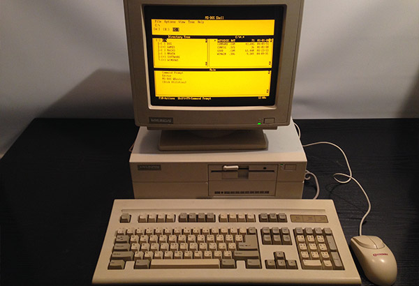
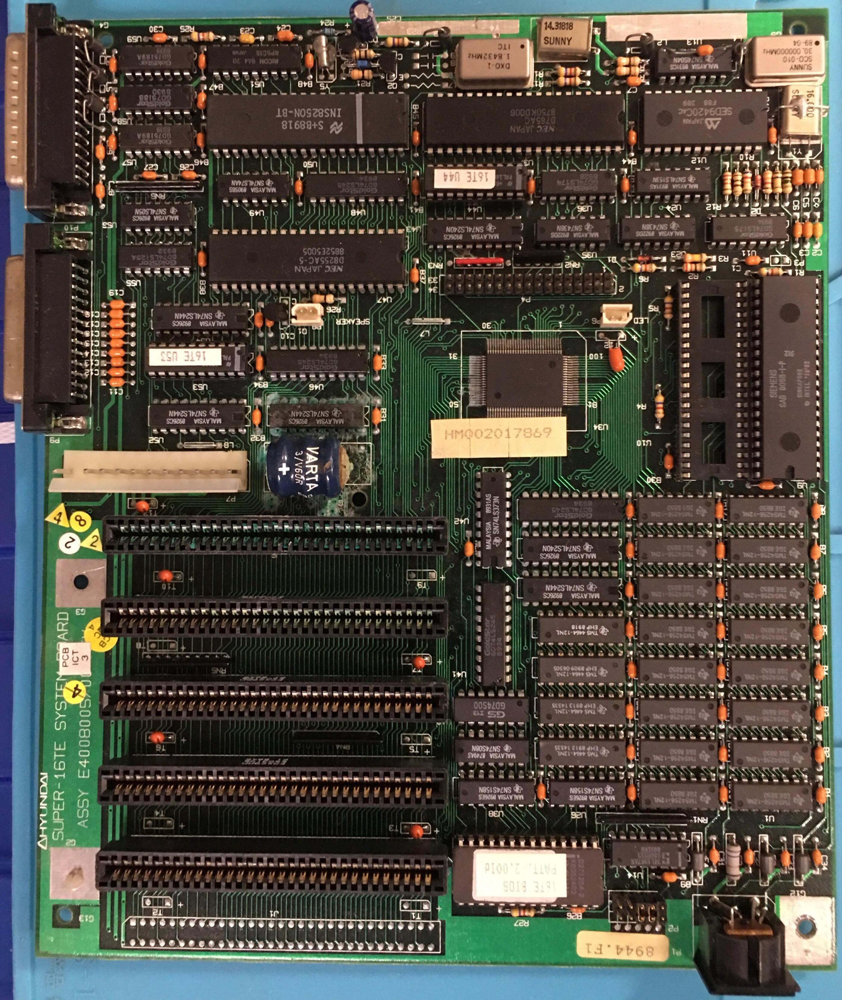
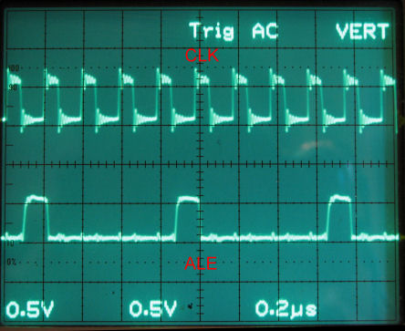

# Hyundai Super-16TE: 

# Guía de Datos Técnicos y Reparación Retrocomputadora

 

---

## 🔢 Información Técnica General

| Atributo                  | Valor                                  |
| ------------------------- | ------------------------------------   |
| **Modelo**                | Hyundai Super-16TE                     |
| **Alias**                 | Hyundai E40080057                      |
| **Fecha de Lanzamiento**  | Diciembre 1987                         |
| **Tipo de PC**            | Personal Computer                      |
| **CPU**                   | [Intel 8088 @ 10 MHz](doc/8088.pdf)    |
| **Coprocesador opcional** | Intel 8087 (soporte por jumper)        |
| **Chipset**               | Texas Instruments TACT80101F           |
| **RAM Máxima**            | 640 KB                                 |
| **Tipo de RAM**           | DIP-18 (4bit), DIP-16 (1bit)           |
| **Bus de Expansión**      | [6x ISA 8-bit](doc/isa.png)            |
| **BIOS**                  | Hyundai                                |
| **Tamaño Placa**          | 355mm x 304mm (formato propietario)    |
| **Almacenamiento**        | Seagate 20MB HDD, FDD 5.25"            |
| **Gráficos**              | CGA                                    |
| **Monitor Original**      | 13" ámbar (monocromo)                  |
| **Sonido**                | Altavoz interno                        |
| **Sistema Operativo**     | MS-DOS 5.0, Windows 1.02               |
| **Conectores de Fuente**  | [AT (P8 + P9, 6 pines c/u)](doc/at.jpg)|
| **Puertos**               | RS-232 x2, Paralelo, XT KBD            |
| **Conectores/Jumpers**    |  [ver](doc/jumpers.pdf)                |

---

## **Video**

**CGA** usa señal digital TTL (usa niveles lógicos para representar colores).

- El CGA (Color Graphics Adapter), introducido por IBM en 1981, fue la primera tarjeta gráfica a color para computadoras personales IBM PC. Ofrecía varios modos: texto (40×25 y 80×25), gráficos a 320×200 con 4 colores y 640×200 en monocromo. Aunque limitado a 16 colores, solo podían usarse 4 simultáneamente en gráficos, con combinaciones predefinidas. Su salida compuesta permitía técnicas como el "composite artifacting" para simular muchos más colores, especialmente en televisores NTSC.

- CGA fue revolucionario para su tiempo, permitiendo los primeros videojuegos a color en PC, pero rápidamente fue superado por estándares como EGA y VGA. Aun así, sigue siendo una plataforma querida en la escena retro y demoscene, donde se han logrado proezas técnicas, como el famoso demo 8088 MPH, que muestra más de 1000 colores en una tarjeta CGA original gracias a manipulaciones avanzadas de hardware. Su importancia histórica y legado creativo siguen siendo celebrados hoy.

***VGA** usa señal analógica RGB.

[CGA to VGA scaling with GBS-8220 board](https://oldcrap.org/2018/03/11/cga-to-vga-scaling-with-gbs-8220-board/)

---

## **Bus de expansión ISA**

* **Tipo:** ISA (Industry Standard Architecture) de 8 bits, heredado directamente del IBM PC original.
* **Frecuencia:** Funciona típicamente a **4.77 MHz**, igual que el reloj del procesador 8088.
* **Número de slots:** El Hyundai Super-16TE incluye entre **5 y 8 ranuras ISA de 8 bits**, dependiendo del modelo y configuración exacta.
* **Compatibilidad:** Acepta tarjetas de expansión XT estándar (8 bits), como:

  * Tarjetas CGA, MDA, Hercules.
  * Tarjetas de sonido (como Sound Blaster 1.0).
  * Controladores de disco duro y disquete (XT-IDE, etc.).
  * Tarjetas de red ISA 8-bit (como algunas NE1000).
* **Conectores:** Cada ranura tiene un conector de borde largo (62 contactos, 31 por lado) que encaja con las tarjetas ISA de 8 bits.

---

Este bus fue crucial en la época, ya que permitía a los usuarios ampliar las capacidades del sistema, en un momento en que las funciones como sonido, gráficos avanzados o conectividad no venían integradas. En el caso del Super-16TE, el bus ISA también es útil hoy día para entusiastas retro que desean agregar tarjetas modernas adaptadas a 8 bits, como adaptadores CF-IDE, tarjetas VGA compatibles o interfaces seriales mejoradas.

---
## 🌐 Configuraciones por Jumpers

### ⚖️ NPU (Coprocesador)

| Funcionalidad | Jumper P2           |
| ------------- | ------------------- |
| Deshabilitado | Pins 1 & 2 cerrados |
| Habilitado    | Pins 1 & 2 abiertos |

### 📀 RAM

| Capacidad | Bank 0    | Bank 1    | Bank 2   | Bank 3   |
| --------- | --------- | --------- | -------- | -------- |
| 512KB     | (8) 41256 | (8) 41256 | -        | -        |
| 640KB     | (8) 41256 | (8) 41256 | (2) 4464 | (2) 4464 |

| Tamaño RAM | Jumper P2           |
| ---------- | ------------------- |
| 512KB      | Pins 3 & 4 cerrados |
| 640KB      | Pins 5 & 6 cerrados |

### 💡 Monitor

| Tipo      | Jumper P2            |
| --------- | -------------------- |
| Color     | Pins 7 & 8 cerrados  |
| Monocromo | Pins 9 & 10 cerrados |

### 📄 BIOS

| Tipo  | Jumper P2             |
| ----- | --------------------- |
| 27256 | Pins 11 & 12 cerrados |
| 27128 | Pins 13 & 14 cerrados |

---

## 🚧 Reparación & Prevención de Daños

### ⚠️ Problema conocido: **Batería Ni-Cd con fuga**

* **Ubicación**: Cerca del RTC (Ricoh RP5C15).
* **Riesgo**: Ácido puede dañar pistas internas y componentes adyacentes.
* Podriamos sustituirla por la clásica pila de botón, haciendo una pequeña modificación, revisar [Repositorio](https://github.com/wiretap-retro/Not-A-Varta)

#### ✅ Solución:

1. **Remover la batería inmediatamente.**
2. **Neutralizar residuos alcalinos**.
3. Limpiar con isopropanol al 99%.
4. Revisar continuidad de pistas afectadas.
5. Reemplazar la batería.
   
### ⛏️ Diagnóstico de componentes

* **Cristal de reloj**: Busca un oscilador de **30MHz** que alimenta al 8284 (o integrado).
* **Señal de reloj CPU**: Pin 19 del 8088 (debería tener 10MHz).

 

* Una forma de saber si la CPU está funcionando es su Salida ALE:

La **salida ALE (Address Latch Enable)** en un microprocesador **Intel 8088** se utiliza para **separar las líneas de dirección y datos**, ya que el 8088 multiplexa (comparte) los **8 bits inferiores de la dirección (A0-A7)** con los **8 bits de datos (D0-D7)** en los mismos pines físicos.

### **Función de ALE en el 8088:**
1. **Indica cuándo la dirección está disponible en el bus:**
   - Cuando el 8088 quiere acceder a memoria o E/S, primero coloca la dirección completa (20 bits en el 8088) en el bus.
   - Los **8 bits inferiores (A0-A7)** se comparten con el bus de datos (D0-D7).
   - **ALE se activa (nivel alto)** para indicar que en ese momento los pines multiplexados contienen la dirección y deben ser capturados por un **latch externo**

### **1. Problema con la señal de Clock (CLK)**
#### **Posibles causas:**
- **Condensadores de desacoplamiento (decoupling) dañados o secos**:  
  - Los Condensadores cerca del **8284 (generador de clock)** o del **8088** pueden estar perdiendo capacidad, causando ruido en la señal.  
  - Verifica si hay capacitores hinchados o con fugas (especialmente los electrolíticos y cerámicos cerca del oscilador).

- **Carga excesiva en la salida del CLK**:  
  - Si el **clock** está alimentando muchos dispositivos (ej. controladores de bus, periféricos), la señal puede degradarse.  
  - Prueba desconectando periféricos no esenciales para ver si mejora.

- **Problemas en el cristal o circuito oscilador**:  
  - El cristal de **15 MHz** (usado en el 8284 para generar el CLK de 5 MHz) podría estar defectuoso.  
  - Si tienes un osciloscopio, revisa la señal en el **pin X1/X2 del 8284** (debería ser una onda sinusoidal limpia a 15 MHz).

#### **Soluciones:**
✅ **Reemplazar Condensadores de desacoplamiento** cerca del 8284 y 8088.  
✅ **Verificar el cristal y los resistores/capacitores asociados** al oscilador.  
✅ **Conectar una carga mínima** (solo CPU + RAM) para descartar interferencias.  

---

### **2. Caída de voltaje de 5.1V a 4.67V**
#### **Posibles causas:**
- **Resistencia alta en el conector AT o cables de alimentación**:  
  - Los conectores AT antiguos pueden tener **contactos oxidados**, aumentando la resistencia y causando caída de voltaje.  
  - Usa un multímetro para medir la resistencia entre los pines de +5V (debería ser casi 0Ω).

- **Fuente de alimentación (PSU) débil o desgastada**:  
  - Los Condensadores de filtro en la PSU pueden estar secos, reduciendo su capacidad de entrega de corriente.  
  - Prueba con otra fuente AT (si es posible) o verifica el rizo (ripple) en los +5V con un osciloscopio (debería ser < 50mV).

- **Cortocircuito o consumo excesivo en la placa**:  
  - Un chip defectuoso (ej. RAM, controlador de bus) puede estar consumiendo demasiada corriente.  
  - Mide el consumo total de la placa.  

#### **Soluciones:**
✅ **Limpiar los contactos del conector AT** con alcohol isopropílico.  
✅ **Probar con otra fuente de alimentación** (preferiblemente una AT conocida como buena).  
✅ **Medir consumo de corriente** para descartar cortos o componentes defectuosos.  

---

### **3. Ruido y armónicos en la señal**
#### **Posibles causas:**
- **Mala tierra (GND) o loops de tierra**:  
  - Si la placa no tiene una conexión a tierra sólida, el ruido se acopla en las señales.  
  - Verifica que todos los **GND** del conector AT estén bien conectados.  

- **Falta de filtrado en la alimentación**:  
  - Los **Condensadores de filtro +5V** cerca del 8088 y el 8284 pueden estar fallando.  

* **POST BIOS**: Checar beep o actividad en puerto paralelo (analizador lógico opcional).

---

## 🎓 Chips Principales

| Categoría         | Modelo                        |
| ----------------- | ----------------------------- |
| CPU               | Intel 8088 @ 10MHz            |
| Co-Procesador     | Intel 8087 (opcional)         |
| RTC               | Ricoh RP5C15                  |
| Floppy Controller | NEC µPD765 + Epson SED9420Cac |
| UART              | 8250 (varios fabricantes)     |
| RS-232 Driver     | MC1488                        |
| RS-232 Receiver   | MC1489                        |

---

## ⚖️ Conectores Principales en PCB

| Conector         | Etiqueta en PCB |
| ---------------- | --------------- |
| Floppy Interface | P4              |
| Power LED        | P6              |
| Speaker          | P8              |
| Power Supply     | P8 & P9 (AT)    |
| Parallel Port    | P9              |
| Serial Port      | P10             |
| Teclado XT       | KBD             |

---

## 🛠️ Guía de Reparación Paso a Paso – *Hyundai Super-16TE que no enciende*

---

### **1. Verifica la alimentación eléctrica**

* **Revisa el cable de alimentación** con un multímetro en modo continuidad. Asegúrate de que no esté roto ni dañado.
* **Mide el voltaje de entrada a la fuente de poder (PSU)**. Confirma que recibas 220V AC (o el voltaje de red correspondiente).
* **Inspecciona el fusible de la fuente**. Si está abierto, reemplázalo con uno de igual capacidad. **No lo puentes**.
* **Mide las salidas de la PSU** (+5V, +12V y GND) usando el multímetro. Si no hay voltaje, **repara o reemplaza la fuente**.

---

### **2. Examina visualmente la placa base**

* **Busca componentes dañados**: localiza condensadores hinchados, resistencias quemadas, trazas rotas o chips fisurados.
* **Inspecciona soldaduras**: identifica posibles soldaduras frías o fracturadas en conectores, zócalos y componentes grandes. **resoldar con flux si es necesario**.
* **Mide el voltaje de la batería CMOS**. Si está por debajo de 2.7V, **retírala y reemplázala** (si es tipo Ni-Cd, verifica daños por fuga).

---

### **3. Comprueba señales críticas**

* **Conecta un osciloscopio** al pin del cristal principal y **verifica presencia de señal de reloj** (suele ser 14.318 MHz o 30 MHz dependiendo del diseño).
* **Verifica la señal de reset**: debe empezar en bajo (LOW) y luego subir a alto (HIGH) unos milisegundos tras enceder el sistema.
* **Comprueba la actividad del chipset y BIOS**: si hay voltajes pero ningún signo de vida (ni reloj, ni reset, ni acceso a RAM), **sospecha del BIOS o chipset**. Reprograma el BIOS si puedes.

---

### **4. Haz una prueba de hardware mínimo**

* **Desconecta todos los periféricos**: retira tarjetas ISA, disco duro, unidades floppy. Deja solo CPU, RAM y fuente.
* **Verifica la RAM**: prueba con otros chips compatibles. Si hay varios módulos, prueba uno por uno.
* **Revisa el zócalo de la CPU**: asegúrate de que el chip 8088 esté bien insertado y sin pines doblados.
* **Escucha los beeps del POST** a través del speaker. Anota patrones si los hay (podrían indicar error de RAM, vídeo, CPU, etc.).

---

### **5. Identifica fallas comunes de hardware antiguo**

* **Reemplaza condensadores electrolíticos antiguos**, sobre todo los cercanos al conector AT, al cristal y a los reguladores.
* **Verifica reguladores de voltaje** como el LM7805. Mide que la salida sea +5V. Si entrega menos, reemplázalo.
* **Confirma que los jumpers estén bien configurados**: revisa que RAM, BIOS y NPU estén seleccionados correctamente según el manual.

---

### **6. Usa herramientas sugeridas**

* Utiliza un **multímetro digital** para verificar continuidad, voltajes y posibles cortos.
* Usa un **osciloscopio** para comprobar señales de reloj y reset, especialmente en pin 19 del 8088.
* Usa un **programador de BIOS** para regrabar la EEPROM si hiciera falta.

---

### **7. Resumen de reparación**

| **Paso** | **Descripción** | **Acciones** |
|----------|-----------------|--------------|
| **1. Confirmación de alimentación básica** | Mide las tensiones de la PSU | +5V, +12V, -12V y GND en los conectores AT (P8 y P9). Verifica con multímetro entre rojo (+5V), amarillo (+12V), azul (-12V), negro (GND). |
| | Comprueba el LED de encendido (P6) | Si el LED no enciende, revisa la fuente, el botón de encendido o el fusible. |
| **2. Verifica señales fundamentales del sistema** | Señal de reloj al CPU | Mide en el pin 19 del 8088. Debe haber una señal de 10 MHz (generada por el divisor del cristal de 30 MHz). Si no hay señal, verifica: Cristal oscilador, Chip 8284 o equivalente, Voltaje de alimentación al oscilador. |
| | Señal de RESET al CPU | Pin 21 del 8088. Al enceder, debe estar brevemente en bajo (LOW) y luego pasar a alto (HIGH). Si se queda en bajo o flotante, revisa circuito de reset (generalmente involucra una resistencia, capacitor y a veces un supervisor). |
| **3. Revisión de BIOS y Chipset** | Actividad del BIOS (EPROM 27128 o 27256) | Usa un analizador lógico o pin probe en los pines: /CE (Chip Enable) y /OE (Output Enable). Si no hay actividad, el BIOS no está siendo leído → posible fallo del BIOS, socket, o señal de dirección. |
| | Asegura correcta configuración del jumper del BIOS (P2) | 27256: Pins 11 & 12 cerrados. 27128: Pins 13 & 14 cerrados. ⚠️ Reprograma o reemplaza BIOS si está corrupto. |
| **4. Verifica la RAM** | Mide que haya +5V en pines VCC de los chips RAM | |
| | Probar bancos de RAM individualmente | Retira RAM de Bank 1–3, deja solo Bank 0 (8x 41256). Verifica funcionamiento. Repite con Bank 1. |
| | Inspecciona por chips calientes o sin contacto | ⚠️ Si el POST da beeps de error, anótalos (p.ej., 3 beeps seguidos = RAM). |
| **5. Chequeo del CPU (Intel 8088)** | Asegura que el CPU | Está bien insertado en el zócalo. Tiene voltaje correcto en el pin VCC (pin 40). Tiene reloj (pin 19) y reset (pin 21). |
| | | ✅ Reemplaza temporalmente por otro 8088 si es posible. |
| **6. POST y señalización** | Conecta speaker (P8) y escucha beeps del BIOS | Un beep = inicio exitoso. Múltiples = error (RAM, video, CPU). |
| | Actividad en el puerto paralelo o ISA | Usa analizador lógico si no hay video. Puede mostrar señales de que está intentando iniciar. |
| **7. Prueba mínima de arranque** | Solo componentes esenciales | CPU, RAM mínima (Bank 0), BIOS, Fuente. |
| | | ❌ Desconecta: HDD, FDD, Todas las tarjetas ISA, Periféricos. |
| | | ✅ Si arranca y da beep único: CPU, RAM y BIOS están funcionando. |
| **🛠️ Consejos adicionales** | | Reemplaza condensadores electrolíticos antiguos cerca del conector AT. Revisa fugas por batería Ni-Cd y limpia trazas. Asegúrate de que los jumpers del banco de RAM y tipo de monitor estén correctamente configurados (especialmente si usas CGA y no aparece imagen). El RTC RP5C15 no bloquea el arranque, pero puede causar problemas si hay fuga. |

 ---

